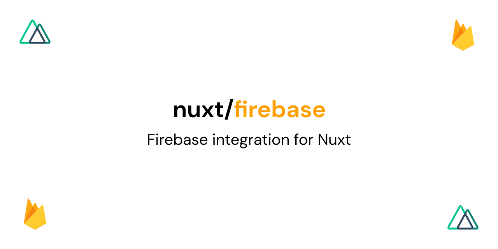

<p align="center">
  
</p>

[](https://david-dm.org/nuxt-community/i18n-module)
[](https://snyk.io/test/github/nuxt-community/firebase-module)
[](https://npmjs.com/package/@nuxtjs/firebase)
[](https://npmjs.com/package/@nuxtjs/firebase)

> Easily integrate Firebase into your Nuxt project.

## IMPORTANT!
> :warning: **BREAKING CHANGES IN VERSION 7.0.0!**:  
Version 7 brings major breaking changes. Make sure to carefully read through the [migration guide](https://firebase.nuxtjs.org/community/migrate) when migrate your application. See the release notes [here](https://github.com/nuxt-community/firebase-module/releases/tag/v7.0.0).

## Links
- 📘 [Documentation](https://firebase.nuxtjs.org/)
- 🔖 [Release notes](https://github.com/nuxt-community/firebase-module/releases)
- 👥 [Community](https://discord.nuxtjs.org/)

## Quick Setup

Make sure you are using the newest version of Nuxt and have Firebase >8.0.0 installed in your project.

```bash
yarn add firebase # OR npm i firebase
```

Install the module via NPM or Yarn:

```bash
yarn add @nuxtjs/firebase # OR npm i @nuxtjs/firebase
```

## Quick Config

Add the following to your nuxt.config.js.

See all configuration options [here](https://firebase.nuxtjs.org/guide/options/).

```js
modules: [
    [
      '@nuxtjs/firebase',
      {
        config: {
          apiKey: '<apiKey>',
          authDomain: '<authDomain>',
          projectId: '<projectId>',
          storageBucket: '<storageBucket>',
          messagingSenderId: '<messagingSenderId>',
          appId: '<appId>',
          measurementId: '<measurementId>'
        },
        services: {
          auth: true // Just as example. Can be any other service.
        }
      }
    ]
  ],
```

## Quick Usage

Now you can use all Firebase services with `this.$fire.auth`, `this.$fire.firestore`, `this.$fire.messaging` etc. (see list [here](https://firebase.nuxtjs.org/guide/usage/)).

Example:

```js
try {
  await this.$fire.auth.createUserWithEmailAndPassword('foo@foo.foo', 'test')
} catch (e) {
  handleError(e)
}
```

## Issues, questions & requests

If you have any questions or issues, check out the [Nuxt Discord server](https://discord.nuxtjs.org).

## License

MIT - [Nuxt-Community](https://github.com/nuxt-community) - [Pascal Luther](https://github.com/lupas)
